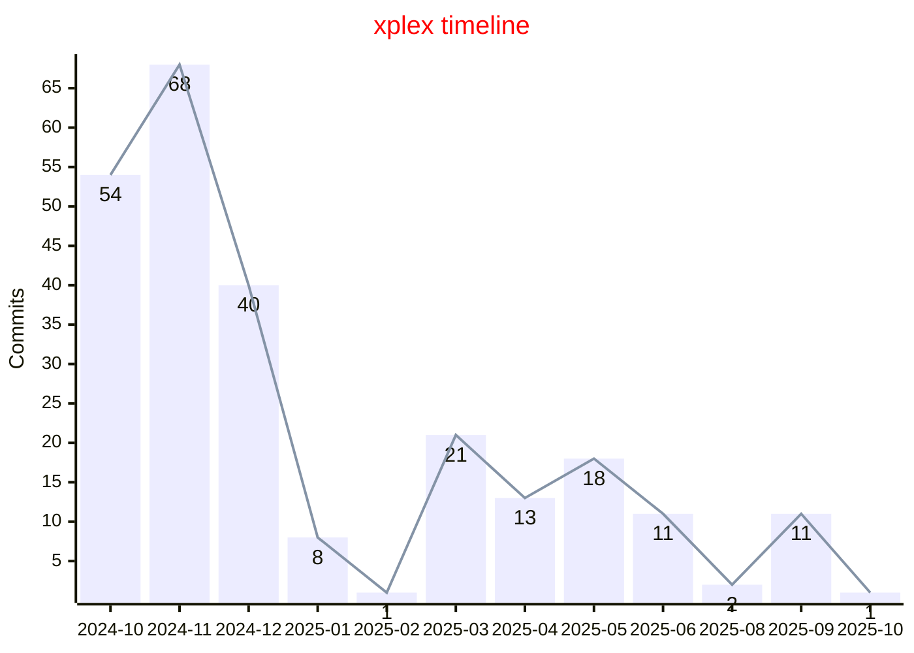

### Hello my dear friend
You know how to reach me: https://www.linkedin.com/in/m-namakshenas/

Looking for more info about #xplex: rotenix.com/xplex

<!-- XPLEX-PUSH-HISTORY-START -->

<!-- XPLEX-PUSH-HISTORY-END -->
